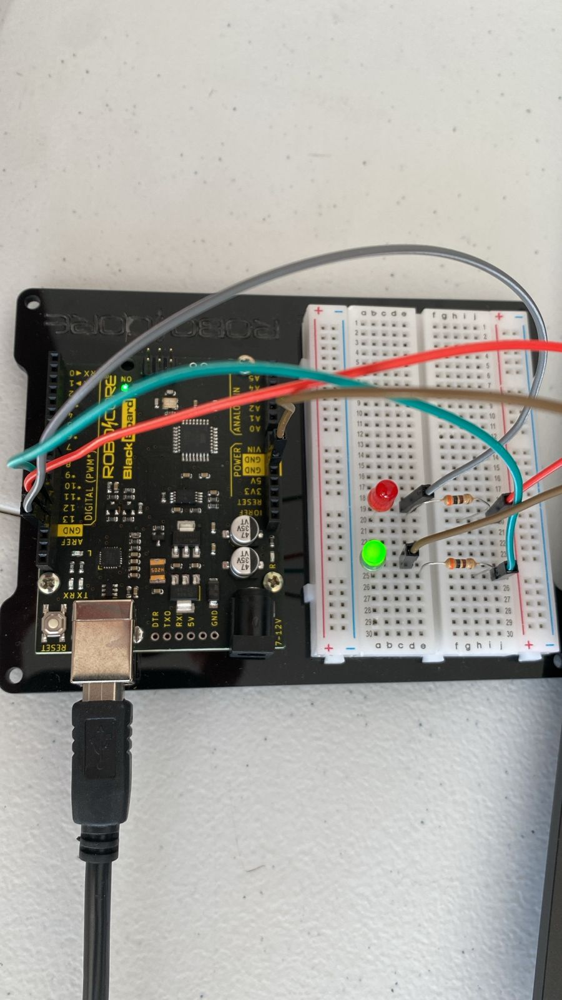
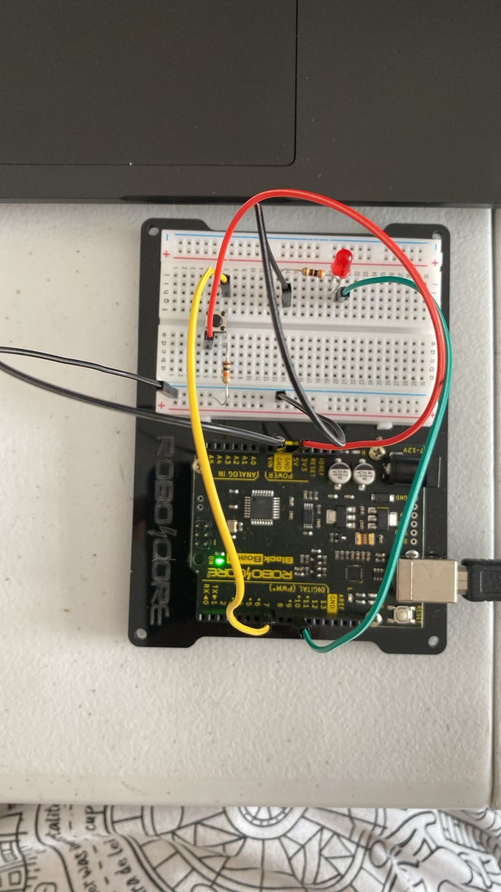

# Arduino Examples
Um conjunto de exemplos apresentados em sala de aula.
 
## Blink Led
Exemplo relacionado ao `Aula 10 - Introdução ao Arduino` e `Aula 11 - Saídas Digitais`, onde fazemos um led piscar.

[Simulador](https://www.tinkercad.com/things/ktN0x3f2SJb-blink-led)

[Source code](./Blink%20Led/Blink_Led/Blink_Led.ino)

### LED Challenge

#### Leds Síncrono

[Simulador](https://www.tinkercad.com/things/0Idigwy2os1-led-sincronos)

[Source code](./Sincronized_Leds/Sincronized_Leds.ino)

#### Leds Alternados

[Simulador](https://www.tinkercad.com/things/f5pSL4FmAWL-leds-alternados)

[Source code](./Alternating_LEDs/Alternating_LEDs.ino)

#### Leds Ritmadas

[Simulador](https://www.tinkercad.com/things/dA42dmlr51q-leds-ritmadas)

[Source code](./Alternating_LEDs/Alternating_LEDs.ino)

## Push Button
Exemplo relacionado ao `Aula 12: Entradas Digitais e Variáveis`, onde fazemos um led piscar ao pressionar um botão.

### Botão simples

[Simulador](https://www.tinkercad.com/things/8ZIVBXm9NUW-botao-simples)

__Esse circuito não tem a necessidade de código relacionado.__

### Botão mais complexo

[Simulador](https://www.tinkercad.com/things/8ZIVBXm9NUW-botao-simples)

[Source code](./Smart_Push_Button/Smart_Push_Button.ino)

### Desafio Botão com dois leds
Quando o botão for pressionado, uma das LEDs deve acender, quando o botão for solto, outra LED deve acender.

[Simulador](https://www.tinkercad.com/things/94CSyRGDmyl-desafio-botao-com-dois-leds)

[Source code](./One_Button_Two_Alternating_LEDS_Challanger/One_Button_Two_Alternating_LEDS_Challanger.ino)

## Comunicação Serial

### Exibindo o valor de uma variável pela Serial

[Simulador](https://www.tinkercad.com/things/5rwW7FfrhYk-exibindo-o-valor-de-uma-variavel-pela-serial)

[Source code](./Show_value__variable_through_Serial/Show_value__variable_through_Serial.ino)

### Exibindo o estado do botão pela Serial

[Simulador](https://www.tinkercad.com/things/agAcwTyRb4G-desafio-botao-com-dois-leds-com-serial)

[Source code](./Show_Button_State_In_Serial_Output/Show_Button_State_In_Serial_Output.ino)

### Leitura de Dados Seriais

[Simulador](https://www.tinkercad.com/things/2VdzJEdY7IJ-leitura-de-dados-seriais)

[Source code](./Serial_Input_Led/Serial_Input_Led.ino)

### Desafío: Semáforo Serial

[Simulador](https://www.tinkercad.com/things/atsWRupcOJI-desafio-semaforo-serial)

[Source code](./Challenge_Serial_Traffic_Light/Challenge_Serial_Traffic_Light.ino)

## Entradas Analógicas

### Leitura dados Potenciômetro

[Simulador](https://www.tinkercad.com/things/4cCe5GLhZro-dados-potenciometro)

[Source code](./potentiometer/potentiometer.ino)

### Desafio: Poste com LDR

[Simulador](https://www.tinkercad.com/things/4REiulvRIdV-desafio-poste-ldr)

[Source code](./Challenge_LDR_Traffic_Light/Challenge_LDR_Traffic_Light.ino)

## Saída Analógica

### Dimmer

[Simulador](https://www.tinkercad.com/things/5iCP23oJetC-dimmer)

[Source code](./Analogic_out_dimmer/Analogic_out_dimmer.ino)

### Dimmer com a função mapper

[Simulador](https://www.tinkercad.com/things/d8dovlpfGX2-dimmer-com-a-funcao-mapper)

[Source code](./Analogic_out_dimmer/Analogic_out_dimmer.ino)

### LED RGB randômico

[Simulador](https://www.tinkercad.com/things/2Pi7VmL2yGo-led-rbg-random)
